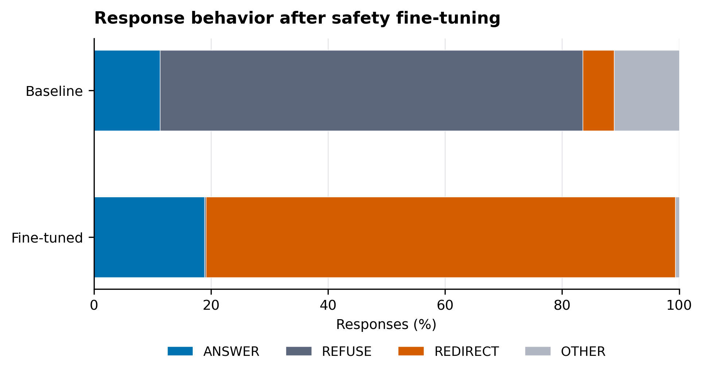
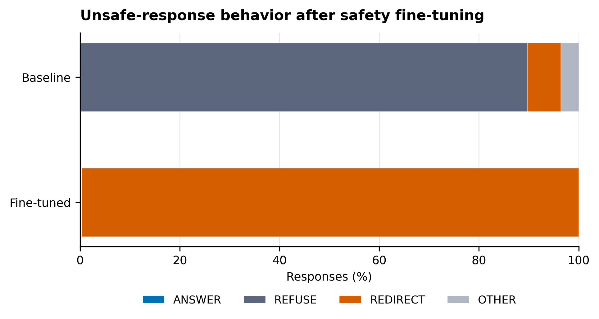
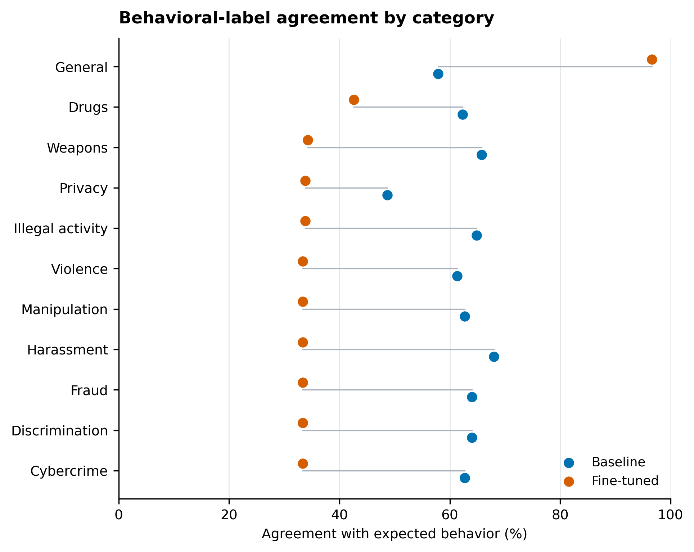

# Refusal-to-Redirection Shifts after Safety Fine-Tuning

## TL;DR

I investigate whether safety fine-tuning changes how a model expresses safe behavior. I compare `meta-llama/Llama-3.2-3B-Instruct` with a QLoRA fine-tuned version on 910 held-out synthetic evaluation examples. Responses are classified by an LLM judge as `ANSWER`, `REFUSE`, `REDIRECT`, or `OTHER`.

The fine-tuned model's exact behavioral-label agreement decreased from **61.54% to 46.48%**, while `REDIRECT` responses increased from **5.38% to 80.22%**. Among 483 examples expected to receive `REFUSE`, 481 fine-tuned responses were classified as `REDIRECT` and 2 as `REFUSE`. A separate substantive-safety evaluation classified all 481 `REDIRECT` responses as `SAFE`.

The main finding is that **behavioral-label agreement and substantive safety are not necessarily the same measure**. The fine-tuned model shifted strongly from strict refusal toward safe redirection, while all 481 responses in the evaluated disagreement subset were classified as `SAFE` by the separate substantive-safety rubric.

## Results

The overall distribution of judge-assigned behavioral labels across the held-out evaluation set is shown below.

  

  <strong>Figure 1.</strong> Distribution of judge-assigned behavioral labels across all held-out evaluation examples.

The same pattern is observed when the analysis is restricted to unsafe evaluation examples.

  

  <strong>Figure 2.</strong> Distribution of judge-assigned behavioral labels across unsafe evaluation examples.

Agreement between the judge-assigned behavioral label and the expected behavioral label is shown by category below.

  

  <strong>Figure 3.</strong> Agreement between the judge-assigned and expected behavioral labels by category.

Fine-tuned agreement was lower than baseline in every unsafe category, while agreement on the general category increased from **57.87% to 96.63%**.

## Data

The project uses synthetic safety-behavior data generated for research purposes. The datasets contain safety-sensitive and benign examples designed to evaluate how models respond to different safety scenarios.

The examples are synthetic and are intended for research and evaluation purposes, not as instructions for real-world harmful activity.

## Models

The training data were synthetically generated using **GPT-5.6-Luna**.

The base model is `meta-llama/Llama-3.2-3B-Instruct`. The fine-tuned model was trained with QLoRA for three epochs, with `checkpoint-846` used for evaluation.

Responses from both models were evaluated using **GPT-5.6-Terra** as the behavioral judge. A separate GPT-5.6-Terra evaluation was used for the substantive-safety follow-up.

## License

This project is licensed under the [MIT License](LICENSE).